<h1>Suhyun Park</h1>

<b>Full-Stack Developer</b> &nbsp;·&nbsp; TypeScript-first &nbsp;·&nbsp; Building scalable web services

  

  
  &nbsp;
  
  &nbsp;
  
  &nbsp;
  

  

---

### About

Full-stack developer with hands-on experience across the entire web development lifecycle — from crafting responsive UIs to designing RESTful APIs and managing relational and non-relational databases.

Primarily write **TypeScript**, work comfortably across multiple frameworks and runtimes, and care deeply about code maintainability, performance, and developer experience.

---

### Tech Stack

**Languages**

**Frontend**

**Frontend / Library & Styling**

**Backend**

**Database**

**DevOps & Infra**

**Design**

**IDE**

---

### GitHub Stats

<!-- SVG: `.github/workflows/update-github-stats.yml` -->

비공개 기여: GitHub <b>Settings → Profile → Contributions</b>에서 <i>Show private contributions on my profile</i> 켜기 (streak·초록 그래프). 상단 카드·언어 비공개 반영은 이 저장소 <b>Actions secrets → <code>STATS_PAT</code></b> (Classic: <code>repo</code>, <code>read:user</code>). 등급 링은 표시하지 않음.

<table>
  <tr>
    <td align="center" valign="top">
      
    </td>
    <td align="center" valign="top">
      
    </td>
  </tr>
  <tr>
    <td colspan="2" align="center">
      
    </td>
  </tr>
</table>

---

### Contact

